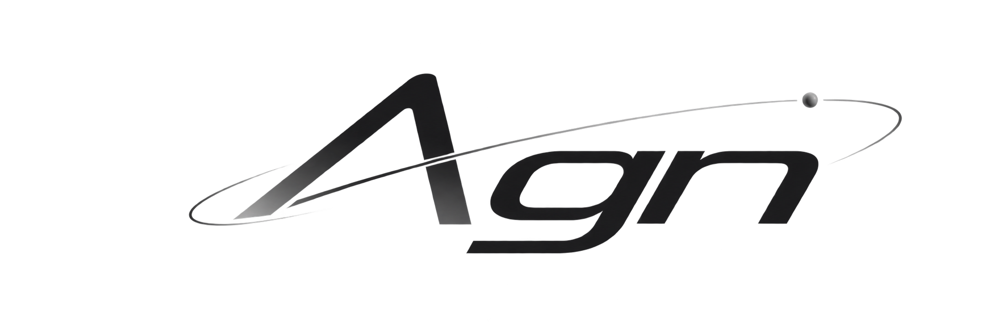
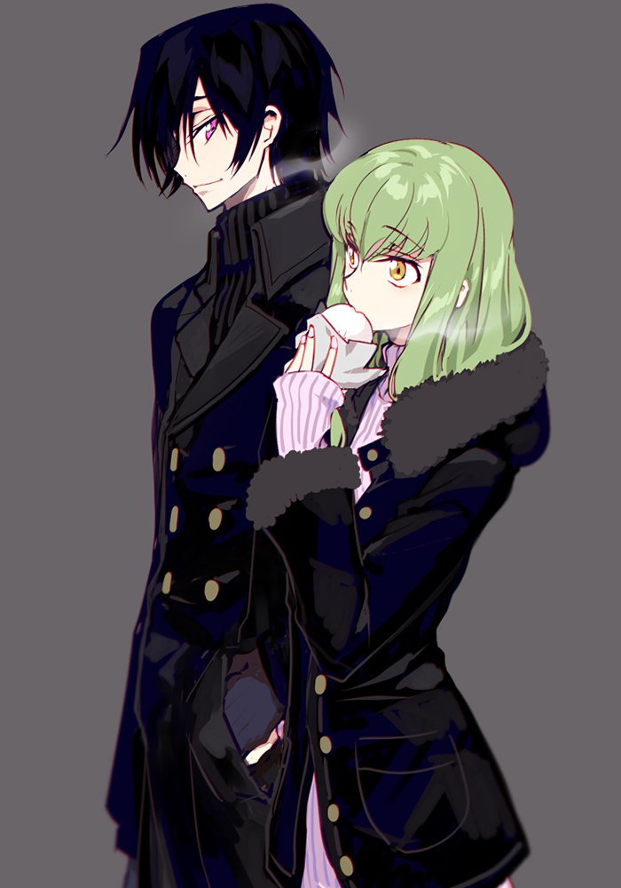

  

<code>robots · physical ai</code>

<table border="0" width="100%">
<tr>
<td valign="top" width="48%">

<h3>/ about me /</h3>

- 💀 mostly working on **private repositories**
- ⚙️ using **C++ / Python / Go**
- 👾 a **student** exploring new ideas
- ⭐ currently working on **robots and unmanned vessels**

<h3>/ current skills /</h3>

#### languages

#### currently learning

#### robotics

#### physical ai

</td>
<td valign="top" width="52%" align="center">
  
</td>
</tr>
</table>
